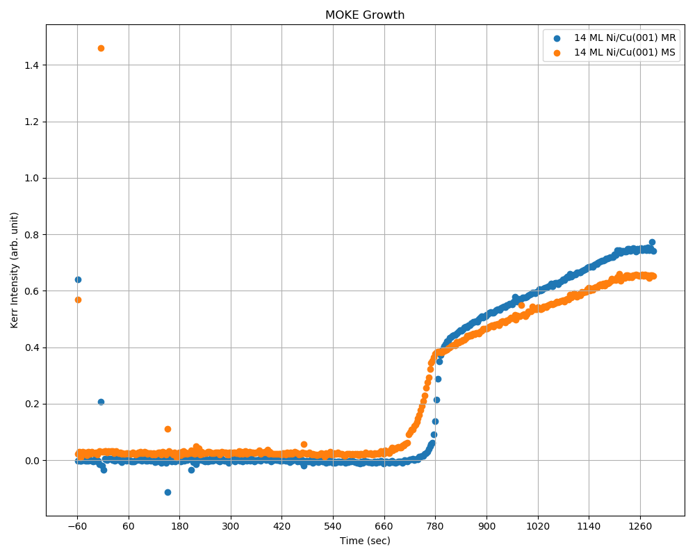
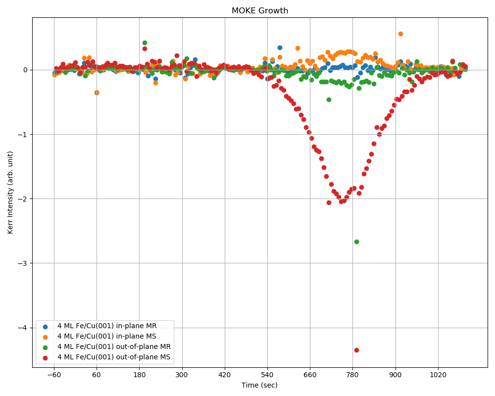
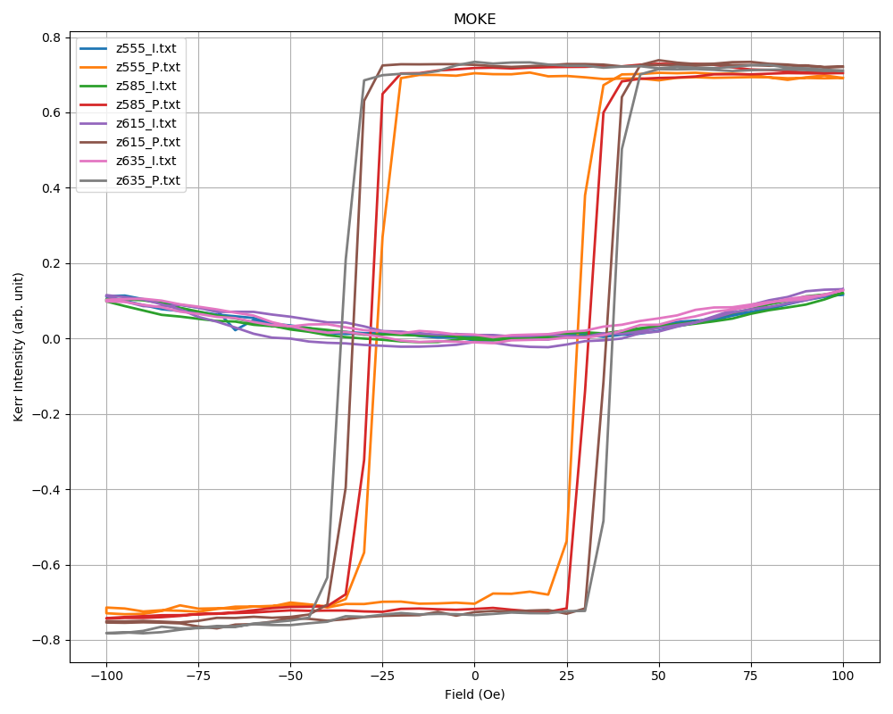
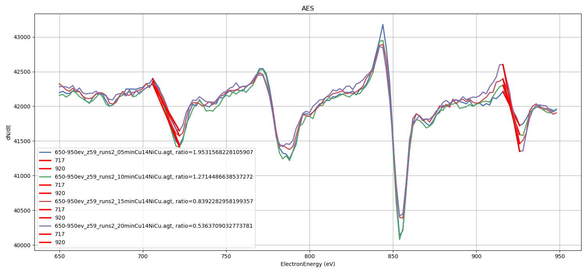

# spinat

Spintronics Analysis Toolbox for Low Dimensional Physics and Nano-Magnetism Lab, NCUE

# Examples

## MOKE Growth Data analysis

### For 1 measure mode (either in-plane or out-of-plane)

1. Set parameters:

```python
file_path = "./DemoData/MOKE_Growth/14NiCu.bin"
iop = "o" # take out-of-plane for example
```

2. Initial process tool:

```python
from spinat import moke_growth
mgp = moke_growth.MokeGrowthProcess(multi_mode=False, iop=iop)
```

3. Get data frame:

```python
df = mgp.preprocess(file_path)
```

4. Plot data:

```python
p = mgp.plot(df, "MR", iop, "14 ML Ni/Cu(001) MR")
final_p = mgp.plot(df, "MS", iop, "14 ML Ni/Cu(001) MS", p=p)
final_p.show()
```

5. Result:



### For 2 measure mode (both in-plane and out-of-plane)

1. Set parameters:

```python
file_path = "./DemoData/MOKE_Growth/4FeCu.bin"
```

2. Initial process tool:

```python
from spinat import moke_growth
mgp = moke_growth.MokeGrowthProcess() # argument is set to 2-mode by default
```

3. Get data frame:

```python
df = mgp.preprocess(file_path)
```

4. Plot data:

```python
p = mgp.plot(df, "MR", "i", "4 ML Fe/Cu(001) in-plane MR")
p = mgp.plot(df, "MS", "i", "4 ML Fe/Cu(001) in-plane MS", p=p)
p = mgp.plot(df, "MR", "o", "4 ML Fe/Cu(001) out-of-plane MR", p=p)
final_p = mgp.plot(df, "MS", "o", "4 ML Fe/Cu(001) out-of-plane MS", p=p)
final_p.show()
```

5. Result:



## MOKE Data analysis

1. Import necessary packages:

```python
from os.path import join as join_path
from os import listdir

from spinat import moke
```

2. Set parameters:

```python
data_path = "./DemoData/MOKE"
```

3. Initial process tool:

```python
mp = moke.MokeProcess()
```

4. Plot all data in path

```python
files = listdir(data_path)
files.sort()
p = None
for file in files:
    df = mp.preprocess(join_path(data_path, file))
    p = mp.plot(df, label=file, p=p)

p.show()
```

5. Result:




## AES Data analysis

**The following example is based on the experiment of Deposit Cu on 14 ML Ni/Cu(001)**

1. Import necessary packages:

```python
from os.path import join as join_path
from os import listdir

from spinat import aes
```

2. Initial process tool and set parameters:

```python
data_path = "./DemoData/AES"
ap = aes.AesProcess()
ap.low_thickness_sensitive = True
ap.based_energy = 717
ap.based_tol = 16
ap.element_energy = 920
ap.element_tol = 6
```

3. Plot and determine edge ratio fot all data in path

```python
files = listdir(data_path)
files.sort()
p = None
for file in files:
    df = ap.preprocess(join_path(data_path, file))
    data = ap.analyze(df)
    p = ap.plot(df, label="{}, ratio={}".format(file, data["ratio"]), p=p)
    p = ap.plot_edge(edge=data["based_edge"], p=p, label="{}".format(ap.based_energy))
    p = ap.plot_edge(edge=data["element_edge"], p=p, label="{}".format(ap.element_energy))

p.show()
```

5. Result:

